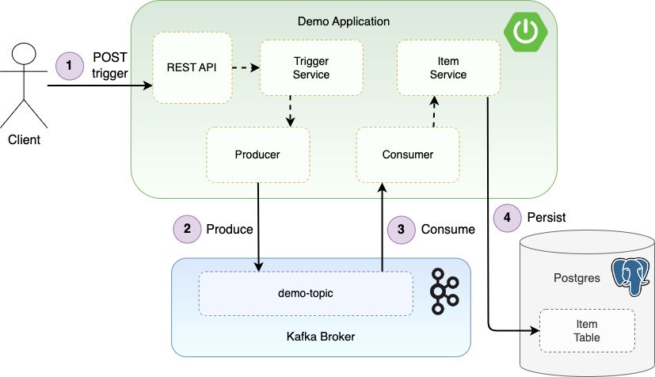

# Monitoring Kafka and Postgres using Prometheus, Grafana and Alertmanager

Demonstrating monitoring Kafka and Postgres using Prometheus, Grafana and Alertmanager.

A Spring Boot application is used to generate Kafka events and perform Postgres operations to demonstrate the metrics capture.

## Monitoring and Alerting Demo

### Start Containers

Start Kafka, Zookeeper, Kafka exporter, Postgres, Postgres exporter, Prometheus, Grafana and Alertmanager:

```
docker-compose up -d
```

The exporters export metrics from Kafka and Postgres respectively for consumption by Prometheus.

### Prometheus

View the exported targets in Prometheus:

1) Navigate to http://localhost:9090/
2) Select the Status dropdown and then Targets

### Grafana

Connect Grafana to the Prometheus data source:

1) Navigate to http://localhost:3000/
2) Login with the default credentials that have autocompleted.
3) Get to Connections / Data sources / Add data source - select Prometheus.
4) Enter the Prometheus URL: http://prometheus:9090 as the Connection URL.
5) Click 'Save & test'.

Import example Kafka dashboard:

1) Navigate to https://grafana.com/grafana/dashboards/7589-kafka-exporter-overview/
2) Download JSON.  (Also available at ./dashboards/kafka_7589_rev5.json).
3) Under 'Dashboards' select 'Create Dashboard' / 'Import dashboard'.
4) Select 'prometheus' as the datasource and import.

Import example Postgres dashboard:

1) Navigate to https://grafana.com/grafana/dashboards/9628-postgresql-database/
2) Download JSON.  (Also available at ./dashboards/postgres_9628_rev7.json)
3) Import as above.

Import example Alertmanager dashboard:

1) Navigate to https://grafana.com/grafana/dashboards/9578-alertmanager/
2) Download JSON.  (Also available at ./dashboards/alertmanager_9578_rev4.json)
3) Import as above.

### Spring Boot Application

The Spring Boot application connects to the Kafka and Postgres instances.  A REST endpoint is provided that when called triggers the application to produce events.  The application then consume these events, and writes corresponding records to the database.



To build and run the application:

1) Build the application:  `mvn clean install`
2) Run the application: `java -jar target/monitoring-demo-1.0.0.jar`
3) Hit the REST endpoint to generate events, specifying the period to send events for, and the delay in milliseconds between each send:
```
 curl -v -d '{"periodToSendSeconds":60, "delayMilliseconds":100}' -H "Content-Type: application/json" -X POST http://localhost:9001/v1/trigger
``` 

Application logs show:
```
INFO  d.s.TriggerService - Sending events for 60 seconds
INFO  d.s.TriggerService - Total events sent: 224
```

Confirm the total events sent has resulted in this many item's being persisted:
```
curl http://localhost:9001/v1/items/count
```
Example response:
```
{"count":224}
```

Note that the producer `linger.ms` is configured as 3 milliseconds, so applying a delay shorter than this will result in batches of events being produced.

### Alertmanager

#### Trigger Alerts
There are two example alerts configured in the `config/rules.yml` file:

1) A health check alert on the running instances (down for over 10 seconds).
2) A Kafka alert Consumer lag on the Kafka topics exceeding 100 over 10 seconds.

To trigger the health check alert, stop the Postgres exporter container instance and wait 10 seconds:
```
docker stop postgres-exporter
```
Restart the container with:
```
docker start postgres-exporter
```

To trigger the Kafka alert, send in a large volume of events to the `demo-topic` (which the Spring Boot application consumes from) and observe the consumer lagging:
```
curl -v -d '{"periodToSendSeconds":10, "delayMilliseconds":0}' -H "Content-Type: application/json" -X POST http://localhost:9001/v1/trigger
```

The Spring Boot application logs out the events as it sends and consumes them, so the long period of time consuming the events can be verified there.

#### View Alerts

Navigate to Alertmanager at http://localhost:9093/ to view the alerts.

Alternatively view the alerts firing in the Alertmanager Grafana dashboard (as configured above).

## Troubleshooting:

The Spring Boot application runs on port 9001.  If the application does not cleanly stop you may get an error on the next run:

```
listen EADDRINUSE: address already in use :::9001
```

Find the port and kill the process:
```
lsof -i -P | grep 9001
kill -9 <processId>
```

## Docker Clean Up

Bring down the Docker containers with:
```
docker-compose down
```

Alternatively force remove with the following command:
```
docker rm -f $(docker ps -aq)
```

If Docker issues occur it can be useful to clean down the Docker env:
```
docker system prune
docker volume prune
```
